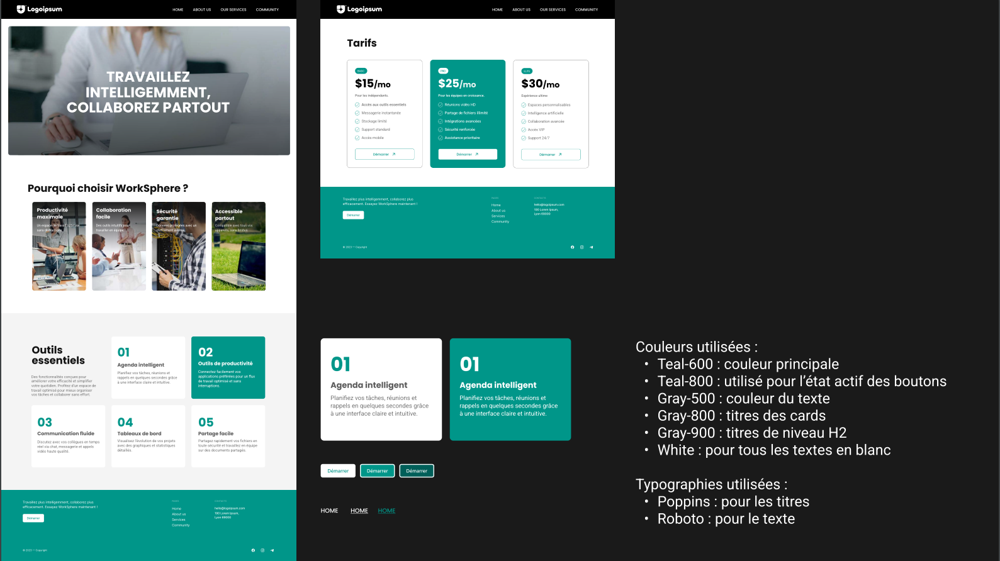

# WorkSphere, outil de collaboration

Site web: **[worksphere-mlangumier.vercel.app](https://worksphere-mlangumier.vercel.app/)**

## Introduction

Site créé par **Mathieu Langumier** dans le cadre d'un exercice de création de site statique en Next.js 15 & Tailwind CSS 4 : adapter une maquette responsive et fonctionnelle.

Le site est déployé automatiquement sur Vercel depuis ce repository, visible en cliquant **[ici](https://worksphere-mlangumier.vercel.app/)**.

## Projet

Pour lancer le projet, utilisez la commande `npm run dev` puis allez sur l'adresser `https://localhost:3000/` (ce projet utitilise le tag `--experimental-https` pour automatiquement créer des certificats HTTPS lors du lancement du serveur de développement).

## Maquette & Charte Graphique

